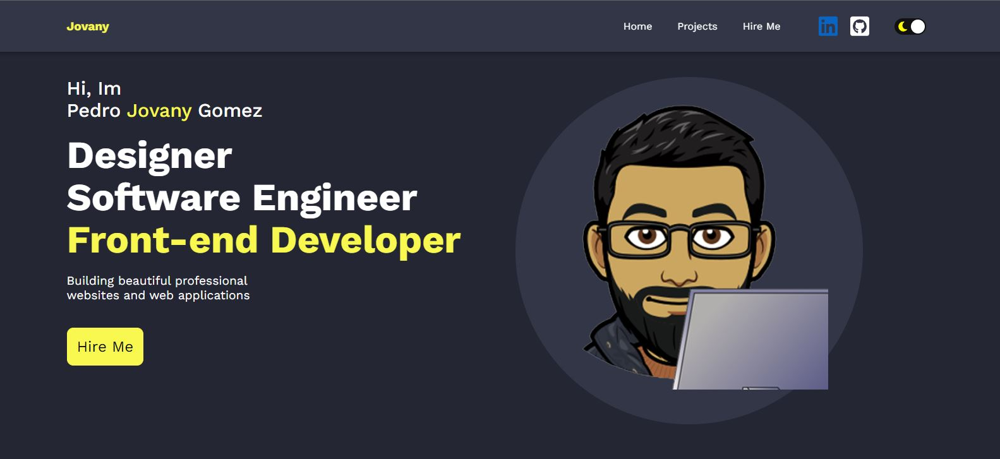
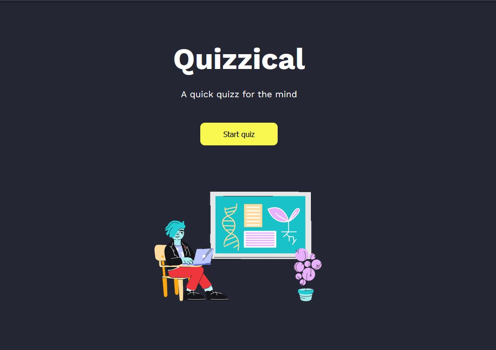
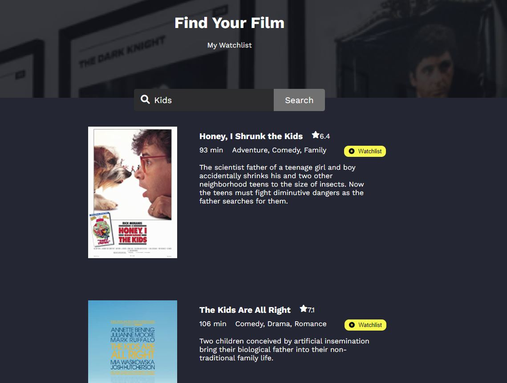
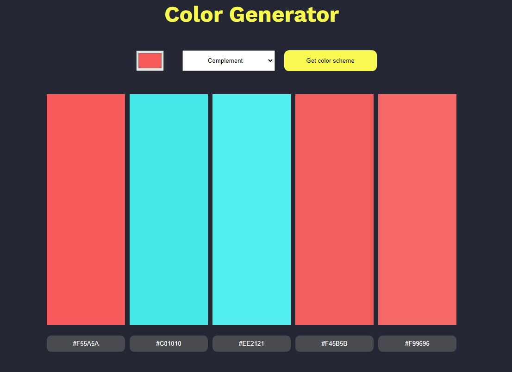

# Jovany's Web Portfolio - Includes all projects

This is a [web portfolio website](https://jovany.dev/) that includes 3 main react projects and 5 mini react projects.

## Table of contents

- [Overview](#overview)
  - [The challenge](#the-challenge)
  - [Screenshot](#screenshot)
  - [Links](#links)
- [Contents of Projects](#contents-of-projects)
- [My process](#my-process)
  - [Built with](#built-with)
  - [What I learned](#what-i-learned)
  - [Continued development](#continued-development)
- [Author](#author)
- [Acknowledgments](#acknowledgments)

## Overview

### The challenge

Users should be able to:

- View the optimal layout for each of the website's pages depending on their device's screen size
- Toggle the dark and light mode for portfolio
- Be able to interact with all the avalible projects
- View each page and be able to toggle between the tabs to see new information

### Screenshot

### Links

- Solution URL: [Add solution URL here](https://github.com/jovanydev/porfolio-with-projects)
- Live Site URL: [Add live site URL here](https://jovany.dev/)

## Contents of Projects

- [Main Projects](#main-projects)
  - Quizzical Trivia
    - [Preview](https://jovany.dev/quizzical-trivia)
    - [GitHub](https://github.com/jovanydev/porfolio-with-projects/tree/main/portfolio-with-projects/src/components/quizzical-trivia)
  - Movie Watchlist
    - [Preview](https://jovany.dev/movie-watchlist)
    - [GitHub](https://github.com/jovanydev/porfolio-with-projects/tree/main/portfolio-with-projects/src/components/movie-watchlist)
  - Color Scheme Generator
    - [Preview](https://jovany.dev/color-scheme-generator)
    - [GitHub](https://github.com/jovanydev/porfolio-with-projects/tree/main/portfolio-with-projects/src/components/color-scheme-generator)
- [Smaller Projects](#smaller-projects)
  - Password Generator
    - [Preview](https://jovany.dev/password-generator)
    - [GitHub](https://github.com/jovanydev/porfolio-with-projects/tree/main/portfolio-with-projects/src/components/password-generator)
  - Invoice Creator
    - [Preview](https://jovany.dev/invoice-creator)
    - [GitHub](https://github.com/jovanydev/porfolio-with-projects/tree/main/portfolio-with-projects/src/components/invoice-creator)
  - Unit Converter
    - [Preview](https://jovany.dev/unit-converter)
    - [GitHub](https://github.com/jovanydev/porfolio-with-projects/tree/main/portfolio-with-projects/src/components/unit-converter)
  - Travel Journal
    - [Preview](https://jovany.dev/travel-journal)
    - [GitHub](https://github.com/jovanydev/porfolio-with-projects/tree/main/portfolio-with-projects/src/components/travel-journal)
  - Digital Business Card
    - [Preview](https://jovany.dev/digital-business-card)
    - [GitHub](https://github.com/jovanydev/porfolio-with-projects/tree/main/portfolio-with-projects/src/components/digital-business-card)

### Main Project Image Preview

## My process

### Built with

- Semantic HTML5 markup
- CSS custom properties
- Flexbox
- Mobile-first workflow
- [React](https://reactjs.org/) - JS library

### What I learned

What I learn was how to use the ReactJS library.

### Continued development

I am working on creating the site into typescript.

## Author

- Website - [Jovany's Website](https://jovany.dev/)
- Frontend Mentor - [@jovanydev](https://www.frontendmentor.io/profile/jovanydev)

## Acknowledgments

I like to acknowledge [Scrimba](https://scrimba.com/) for having the best platform in helping developers become front end developer. All the knowledage to create this amazing portfolio is thanks to their platform at a small reasonable price.
