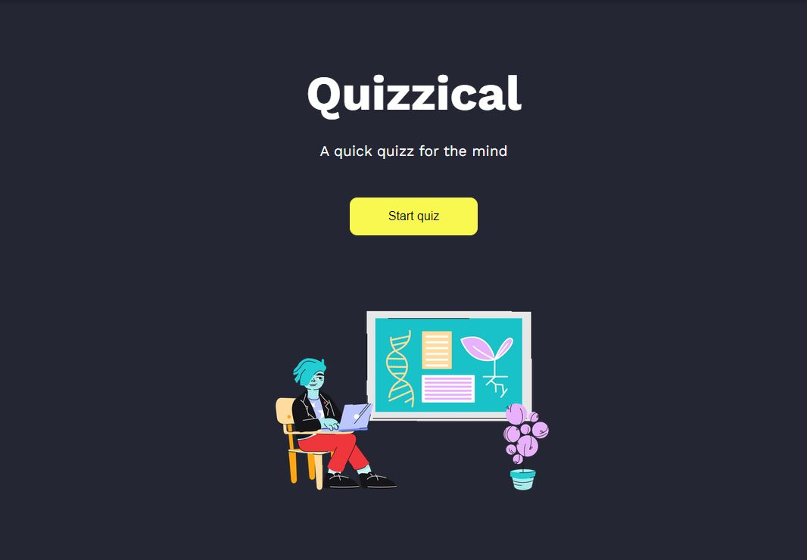

# Quizzical Trivia Web Application

## Table of contents

- [Overview](#overview)
  - [The challenge](#the-challenge)
  - [Screenshot](#screenshot)
  - [Links](#links)
- [My process](#my-process)
  - [Built with](#built-with)
  - [What I learned](#what-i-learned)
  - [Continued development](#continued-development)
- [Author](#author)
- [Acknowledgments](#acknowledgments)

## Overview

### The challenge

Users should be able to:

- View the optimal layout for each of the website's pages depending on their device's screen size
- Be able to toggle from dark and light mode
- Take a short quiz
- Click and decide on the question answers
- Receive instant feed on correct and wrong answers.
- Recieve a score base on the correct answers.

### Screenshot

### Links

- Solution URL: [Jovany Dev Website: Trivia](https://jovany.dev/quizzical-trivia)
- Live Site URL: [Github Quizzical](https://github.com/jovanydev/projects/tree/main/portfolio/src/components/quizzical-trivia)

## My process

### Built with

- Semantic HTML5 markup
- CSS custom properties
- Flexbox
- Mobile-first workflow
- [React](https://reactjs.org/) - JS library

### What I learned

A few things I learn were using the useEffect for fetching the API, storing into local storage, and creating a Movie componment to display movie's info (picture, plot summary, rating, ect).

### Continued development

Next is to develope a netflix style movie list. The movie's information will be hidden until the user hovers or focuses an element to show the information.

## Author

- Website - [Jovany Gomez](jovany.dev)
- Frontend Mentor - [@jovanydev](https://www.frontendmentor.io/profile/jovanydev)
- LinkedIn - [Pedro Jovany Gomez](https://www.linkedin.com/in/itsjovany/)

## Acknowledgments

I like to acknowledge [Scrimba](https://scrimba.com/) for having the best platform in helping developers become front end developer. All the knowledage to create this amazing portfolio is thanks to their platform at a small reasonable price.
